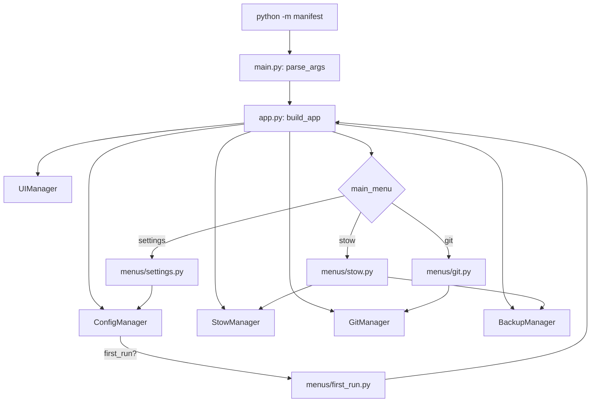
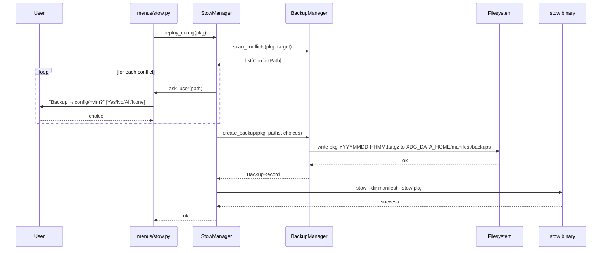

## Manifest Refactoring & Bug-Fix Plan

### Summary of Decisions

| Topic                 | Decision                                                                                                                                     |
| --------------------- | -------------------------------------------------------------------------------------------------------------------------------------------- |
| Menu organization     | `manifest/core/menus/` package, one file per menu                                                                                            |
| Manager return values | Custom exceptions ([`StowError`](manifest/core/stow.py:1), [`GitError`](manifest/core/git.py:1), [`ConfigError`](manifest/core/config.py:1)) |
| Backup location       | Platform-aware XDG data dir (Linux: `$XDG_DATA_HOME/manifest/backups`, macOS: `~/Library/Application Support/manifest/backups`)              |
| Backup trigger        | Pre-deploy scan, before `stow --stow` is invoked                                                                                             |
| Backup format         | Tar/gzip archive of the conflicting subtree                                                                                                  |
| User prompt           | Per-conflict, with a "yes to all / no to all" option                                                                                         |
| Backup failure        | Retry prompt unless failure is non-retryable; abort deploy on give-up                                                                        |

### Target Project Structure

```
manifest/
├── __init__.py
├── __main__.py              # `python -m manifest` entry
├── main.py                  # CLI parser + app bootstrap (slim)
├── app.py                   # Main event loop + manager wiring
├── exceptions.py            # StowError, GitError, ConfigError, BackupError
├── core/
│   ├── __init__.py
│   ├── config.py            # ConfigManager (typed, full docstrings)
│   ├── git.py               # GitManager (raises GitError)
│   ├── stow.py              # StowManager (raises StowError)
│   ├── ui.py                # UIManager (typed, full docstrings)
│   ├── utils.py             # console, logger, prompts (cleaned up)
│   ├── paths.py             # Platform-aware XDG path resolution
│   ├── backup.py            # NEW: BackupManager - conflict scan, tar/gz, restore hooks
│   └── menus/
│       ├── __init__.py
│       ├── stow.py          # handle_stow_menu
│       ├── git.py           # handle_git_menu
│       ├── settings.py      # handle_settings_menu (fills placeholder cases)
│       └── first_run.py     # first_run wizard
└── default_configs/         # unchanged
```

### Data Flow (Refactored)



### Backup-on-Deploy Flow



### Files to Create / Modify

| File                                                                   | Action  | Notes                                                                                            |
| ---------------------------------------------------------------------- | ------- | ------------------------------------------------------------------------------------------------ |
| [`manifest/exceptions.py`](manifest/exceptions.py)                     | create  | Hierarchy: `ManifestError` → `StowError`, `GitError`, `ConfigError`, `BackupError`               |
| [`manifest/main.py`](manifest/main.py)                                 | rewrite | Only `parse_args()` + entry to `app.run()`                                                       |
| [`manifest/app.py`](manifest/app.py)                                   | create  | `run(args) -> NoReturn`: build managers, run main loop                                           |
| [`manifest/__main__.py`](manifest/__main__.py)                         | create  | `from .main import main; main()`                                                                 |
| [`manifest/core/paths.py`](manifest/core/paths.py)                     | create  | `data_dir()`, `backup_root()`, `config_dir()` using `platform.system()`                          |
| [`manifest/core/backup.py`](manifest/core/backup.py)                   | create  | `BackupManager` with `scan_conflicts`, `create_backup`, `list_backups`, `restore_backup` stub    |
| [`manifest/core/config.py`](manifest/core/config.py)                   | rewrite | Full type hints, raise `ConfigError`, use `paths.py`                                             |
| [`manifest/core/stow.py`](manifest/core/stow.py)                       | rewrite | Raise `StowError`; inject `BackupManager`; call `scan_conflicts` + `create_backup` before deploy |
| [`manifest/core/git.py`](manifest/core/git.py)                         | rewrite | Raise `GitError`; full type hints                                                                |
| [`manifest/core/ui.py`](manifest/core/ui.py)                           | rewrite | Full type hints; new `confirm_backup(path) -> BackupChoice` (Yes / No / YesToAll / NoToAll)      |
| [`manifest/core/utils.py`](manifest/core/utils.py)                     | rewrite | Remove dead `pal`/`custom_theme` references; typed; full docstrings                              |
| [`manifest/core/menus/__init__.py`](manifest/core/menus/__init__.py)   | create  | Re-export handlers                                                                               |
| [`manifest/core/menus/stow.py`](manifest/core/menus/stow.py)           | create  | Ported from `main.py`; uses exceptions                                                           |
| [`manifest/core/menus/git.py`](manifest/core/menus/git.py)             | create  | Ported from `main.py`; uses exceptions                                                           |
| [`manifest/core/menus/settings.py`](manifest/core/menus/settings.py)   | create  | Ported + implement `import_settings`/`export_settings`/`reset_settings`                          |
| [`manifest/core/menus/first_run.py`](manifest/core/menus/first_run.py) | create  | Ported `first_run`                                                                               |
| [`ARCHITECTURE.md`](ARCHITECTURE.md)                                   | rewrite | Reflects new layout                                                                              |
| [`README.md`](README.md)                                               | update  | Backup/restore feature, screenshots later                                                        |

### PEP 8 / Typing / Docstring Standard

- All functions get full Google-style docstrings with `Args:`, `Returns:`, `Raises:`, `Yields:` as applicable.
- All public functions and methods get parameter and return type annotations; `-> None` for void.
- Use `from __future__ import annotations` in every module for forward refs and PEP 563.
- Module-level constants in `UPPER_SNAKE_CASE`; classes in `PascalCase`; everything else `snake_case`.
- `ruff` config already enforces `select = ["D", "E", "F", "W", "I", "DOC", "UP"]` and Google convention - no `pyproject.toml` changes needed.
- Add `mypy --strict` (or `pyright strict`) to dev deps; wire into pre-commit.

### BackupManager Public API

```python
class BackupManager:
    def __init__(self, backup_root: Path) -> None: ...
    def scan_conflicts(self, package: Path, target: Path) -> list[ConflictPath]: ...
    def create_backup(
        self,
        package: str,
        paths: list[Path],
        choices: dict[Path, BackupChoice],
    ) -> BackupRecord: ...
    def list_backups(self, package: str | None = None) -> list[BackupRecord]: ...   # for future restore UI
```

```python
class BackupChoice(StrEnum):
    YES = "yes"
    NO = "no"
    YES_TO_ALL = "yes_to_all"
    NO_TO_ALL = "no_to_all"

@dataclass(frozen=True)
class BackupRecord:
    package: str
    timestamp: datetime
    archive_path: Path
    backed_up_paths: tuple[Path, ...]
```

### Settings Menu - Filling the Gaps

The placeholder `pass` cases get real implementations:

- `import_settings`: prompt for source `.conf`, validate keys, merge with current.
- `export_settings`: write current opts to a user-chosen path.
- `reset_settings`: confirm, then delete `config_file_path` and re-run `_ensure_user_config()`.

### Implementation Order

1. **Foundation** - `exceptions.py`, `paths.py`, `__main__.py` (zero behavior change, just plumbing).
2. **Cleanup pass** - rewrite `config.py`, `utils.py` with full types/docstrings/exceptions.
3. **Git rewrite** - `git.py` raises `GitError`, full types.
4. **Stow rewrite** - `stow.py` raises `StowError`, accepts injected `BackupManager`.
5. **New: BackupManager** - `backup.py` with scan/create_backup/list_backups.
6. **UI rewrite** - typed `UIManager`, add `confirm_backup` method.
7. **Menu package** - extract four menu handlers into `core/menus/`.
8. **App bootstrap** - new `app.py` + slim `main.py`.
9. **Settings gaps** - implement the three placeholder cases.
10. **Docs** - rewrite `ARCHITECTURE.md`, update `README.md`.
11. **Tooling** - add `mypy`/`pyright` to dev deps + pre-commit.

### Verification Checklist (post-implementation)

- [ ] `ruff check manifest` clean.
- [ ] `ruff format --check manifest` clean.
- [ ] `pyright manifest` reports zero errors.
- [ ] `python -m manifest --help` works.
- [ ] First-run wizard completes on an empty config dir.
- [ ] Cloning an existing dotfile repo, then `Deploy Configuration` with pre-existing target files prompts the user and creates a `.tar.gz` under the platform backup dir.
- [ ] `Backup - NoToAll` leaves targets in place; stow reports conflicts (expected).
- [ ] `Settings → Reset` regenerates a fresh `manifest.conf` from defaults.
